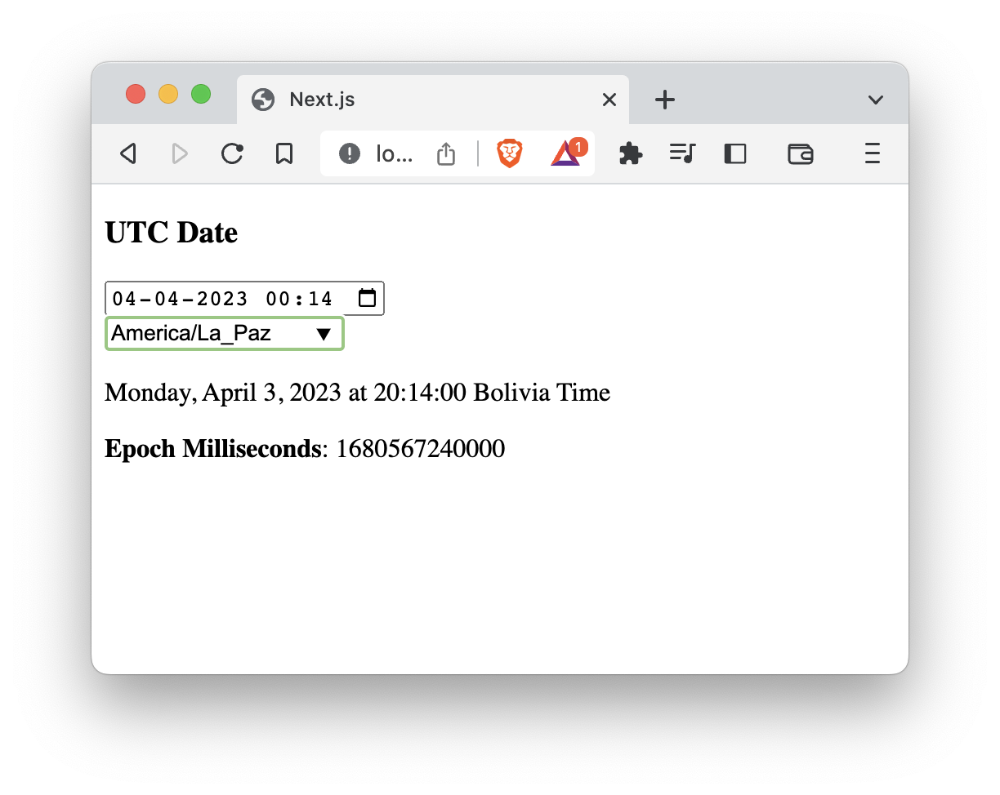

This is a web application that allows you to input a date and a timezone, and it will display the time in the specified timezone. Additionally, the application can receive timezone, date, and locale parameters in the URL.

## Installation

To install this application, you must have Node.js installed on your computer.

1. Clone the repository to your local machine.
2. Navigate to the root directory of the project in your terminal.
3. Run `npm install` to install the project dependencies.

## Usage

To run the application, navigate to the root directory of the project in your terminal and run `npm start`. This will start the server and the application will be available at `http://localhost:3000`.

To pass parameters through the URL, use the following format: `http://localhost:3000/?timezone=<timezone>&date=<date>&locale=<locale>`. Replace <timezone>, <date>, and <locale> with the desired values.

## Contributing

If you would like to contribute to this project, please fork the repository and submit a pull request with your changes.

## License

This project is licensed under the MIT License. See the LICENSE file for details.
